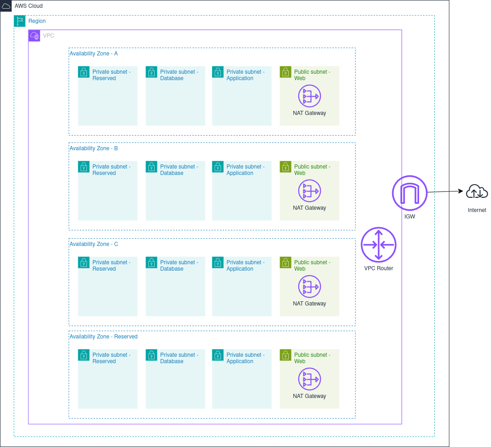

# AWS_Cantrill_Training
Project Animals4Life through Adrian Cantrill's course.

# Setting Up the Organization
AWS has organizations that can control accounts.  You have a management/master account and have organizational accounts.  It's best to structure the organizational accounts inside of organizational units.  This allows you to apply security control policies to the organizational unit which will then be applied to each account in that group.  

For this project, we set up a general account, a prod account within a prod OU and a dev account within a dev OU.  We didn't use an SCP, but I have one in the diagram just to show where they go and what they apply to.  The SCP can be set up to restrict access to certain products within AWS.  For instance, we could set it up to deny access to S3 and accounts within the OU would not be able to access S3.

With this setup, I can log in to the general account and assume an admin role in either the dev or prod accounts.


## Cloud Trail and Cloud Watch Logs
I enabled a cloud trail across all of the accounts in the organization.  It will record API events for management actions on the account.  This includes things like changing IAM policies, creating EC2 instances, creating S3 buckets etc.  We set it up to monitor events in all AWS regions.  Data events and insights events are disabled as they will likely incur costs.  We are trying to remain in the free tier with the project.

# Setting Up the Network

I must take into consideration that A4L is a global organization and that it could become huge when considering underlying network infrastructure. 

I have some contraints on the network that I can implement.  The Animals4Life organization has existing architecture with its on premises locations, azure, google cloud, and previous aws implementation.

* 192.168.10.0/24 (On Premises Office in Sydney)
* 10.0.0.0/16 (AWS)
* 172.31.0.0/16 (Azure)
* 192.168.15.0/24 (London Office)
* 192.168.20.0/24 (New York Office)
* 192.168.25.0/24 (Seattle Office)
* Google is unknown, but the default range is 10.128.0.0/9

So, I need to avoid all of these IP ranges.

With a large organization, I will use the 10 space.  AWS limits the smallest network of /28 and largest a /16 network.  I will avoid common ranges of 10.0 and 10.1 - 10.10.  I can start at 10.16 since it's easy for the base 2 structure.

Since the business can become large, I will assume that it will be global and use up to 5 regions (2x US, 1x Europe, Australia x2) with 4 accounts and 2+ networks per region. That's 40 IP ranges minimum.

Starting at 10.16.0.0/16
We'll do 4 AZ which is 3 AZ plus one spare. We'll do 4 subnets in each AZ, Web, Application, Database, Spare. That's 16 total subnets in the VPC. 

Splitting 10.16.0.0/16, splitting it into 16 subnets, each subnet will result in a /20 network (4096 IP per subnet).

For this network, we have the following

|az  |subnet|IP CIDR|IP range|
|----|----|---|---|
|A|Reserved    |10.16.0.0/20|10.16.0.0.0 - 10.16.15.255|
|A|Database    |10.16.16.0/20|10.16.16.0 - 10.16.31.255|
|A|Application |10.16.32.0/20|10.16.32.0 - 10.16.47.255|
|A|Web         |10.16.48.0/20|10.16.48.0 - 10.16.63.255|
|B|Reserved    |10.16.64.0/20|10.16.64.0.0 - 10.16.79.255|
|B|Database    |10.16.80.0/20|10.16.80.0 - 10.16.95.255|
|B|Application |10.16.96.0/20|10.16.96.0 - 10.16.111.255|
|B|Web         |10.16.112.0/20|10.16.112.0 - 10.16.127.255|
|C|Reserved    |10.16.128.0/20|10.16.128.0.0 - 10.16.143.255|
|C|Database    |10.16.144.0/20|10.16.144.0 - 10.16.159.255|
|C|Application |10.16.160.0/20|10.16.160.0 - 10.16.175.255|
|C|Web         |10.16.176.0/20|10.16.176.0 - 10.16.191.255|
|Spare|Reserved|10.16.192.0/20|10.16.192.0 - 10.16.207.255|
|Spare|Database|10.16.208.0/20|10.16.208.0 - 10.16.223.255|
|Spare|Database|10.16.224.0/20|10.16.224.0 - 10.16.239.255|
|Spare|Database|10.16.240.0/20|10.16.240.0 - 10.16.255.255|

We'll attach a NAT gateway in the public subnets so that the resources in the private subnets can access the internet to get updates.  The VPC will need an internet gateway attached as well.  Note that the NAT gateway is an availability zone construct and they will require Elastic IP addresses assigned to them.  Only one internet gateway can be attached to a VPC. Each region will have a separate network.  US-1 will be 10.16.0.0/16, US2 will be 10.32.0.0/16 etc. 

We will implement this network concept in five different regions as necessary.  The main thing is that we have devised a networking strategy that is global and can accomodate large growth.  
Below is a diagram: 



# S3 Multi Region Access Points - Mini Project

I am going to create an S3 multi region access point. Access points let you create a single global s3 endpoint and point it to multiple s3 buckets.  It allows routing to the closest s3 service.

The first thing to do is to set up buckets in two different regions.

```
multi-region-demo-nvirginia
multi-region-demo-sydney-1
```

Next I create an S3 Multi-Region Access Point, `multi-region-access-point`.

Next, we'll enable replication between the two buckets.  We can do that by selecting the multi-region access point and configuring replication.  We'll make it active-active so that both buckets will have the same objects.


Make some files in cloud shell and upload them to the closest s3 bucket using the ARN of the multi-access point.
```
dd if=/dev/urandom of=test1.file bs=1M count=10
aws s3 cp test1.file s3://<s3mulit-access-arn>
```
When running this command in us-east-2 on cloud shell, it will upload to the us-east-1 region bucket then replication will take place.  The access point picks the closest region to upload.

Note that access might not be immediate for users in Sydney when using the multi-region access point since replication takes a little bit.  We could use RTC with an SLA of 15 minutes for additional cost.


# Other Tasks Along the Way - Demos
## Static Website - S3

I set up a new bucket, enabled public access on create, uploaded files, and allowed static website hosting. 

When I first try to navigate to the webpage, we get a 403 Forbidden error.  This is because I haven't set up any permissions for anyone to access S3 objects.  I am trying to access as an anonymous user when I open it through a web browser.  The anonymous user is unauthenticated.

To do this, we make a resource policy for the bucket that allows access to **objects in the bucket.**  The "Principal" of "*" gives access to anyone on the web.
```
{
    "Version":"2012-10-17",
    "Statement":[
      {
        "Sid":"PublicRead",
        "Effect":"Allow",
        "Principal": "*",
        "Action":["s3:GetObject"],
        "Resource":["arn:aws:s3:::examplebucket/*"]
      }
    ]
  }
```
Now, we can see the website for the top 10 animals...judged by Merlin the cat.

